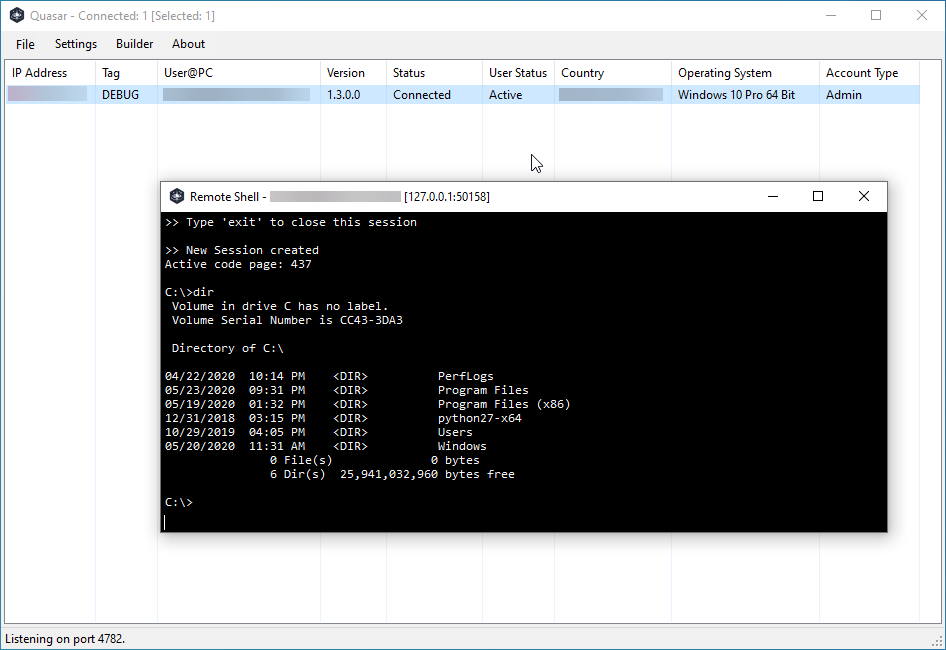

# Orion
**WARNING: Orion is intended for use only on systems you own or are authorized to test. Unauthorized use is strictly prohibited.**

See [TERMS_OF_USE.txt](TERMS_OF_USE.txt) for detailed usage terms.

**Free, Open-Source Remote Administration Tool for Windows**

Orion is a fast and light-weight remote administration tool coded in C#. The usage ranges from user support through day-to-day administrative work to employee monitoring. Providing high stability and an easy-to-use user interface, Orion is the perfect remote administration solution for you.

Please check out the [Getting Started](https://github.com/quasar/Orion/wiki/Getting-Started) guide.

## Screenshots

## Features
* TCP network stream (IPv4 & IPv6 support)
* Fast network serialization (Protocol Buffers)
* Encrypted communication (TLS)
* UPnP Support (automatic port forwarding)
* Task Manager
* File Manager
* Remote Desktop
* Remote Shell / Command Execution (logged)
* System Information
* System Power Commands (Restart, Shutdown, Standby)
* ... and many more!

## Download
* [Latest stable release](https://github.com/quasar/Orion/releases) (recommended)
* [Latest development snapshot](https://ci.appveyor.com/project/MaxXor/quasar)

## Supported runtimes and operating systems
* .NET Framework 4.5.2 or higher
* Supported operating systems (32- and 64-bit)
  * Windows 11
  * Windows Server 2022
  * Windows 10
  * Windows Server 2019
  * Windows Server 2016
  * Windows 8/8.1
  * Windows Server 2012
  * Windows 7
  * Windows Server 2008 R2
* For older systems please use [Orion version 1.3.0](https://github.com/quasar/Orion/releases/tag/v1.3.0.0)

## Compiling
Open the project `Orion.sln` in Visual Studio 2019+ with installed .NET desktop development features and [restore the NuGET packages](https://docs.microsoft.com/en-us/nuget/consume-packages/package-restore). Once all packages are installed the project can be compiled as usual by clicking `Build` at the top or by pressing `F6`. The resulting executables can be found in the `Bin` directory. See below which build configuration to choose from.
For convenience you can run `./build.sh` to automatically restore packages and build the solution.

## Building a client
| Build configuration         | Usage scenario | Description
| ----------------------------|----------------|--------------
| Release configuration       | Production     | Start `Orion.exe` and use the client builder.

## Contributing
See [CONTRIBUTING.md](CONTRIBUTING.md)

## Roadmap
See [ROADMAP.md](ROADMAP.md)

## Documentation
See the [wiki](https://github.com/quasar/Orion/wiki) for usage instructions and other documentation.

## License
Orion is distributed under the [MIT License](LICENSE).  
Third-party licenses are located [here](Licenses).

## Thank you!
I really appreciate all kinds of feedback and contributions. Thanks for using and supporting Orion!
